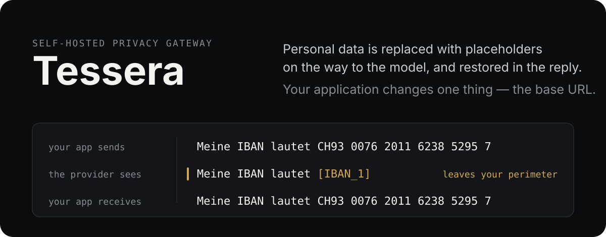
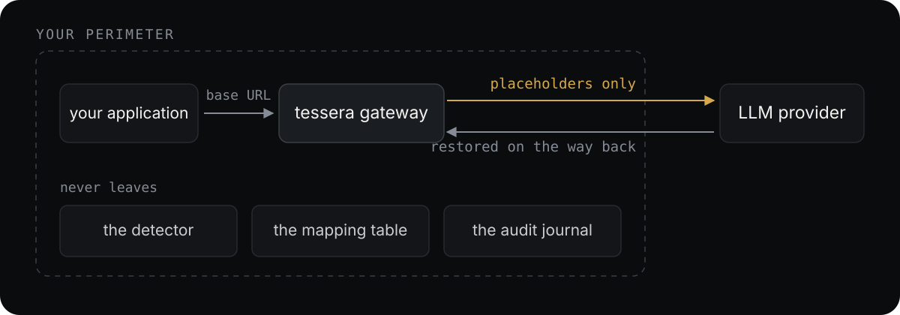

<p align="center">
  
</p>

<p align="center">
  <a href="https://github.com/paderinandrey/tessera/actions/workflows/ci.yml"></a>
  <a href="LICENSE"></a>
</p>

**Tessera** sits as a transparent reverse proxy between your application and an LLM
provider (OpenAI- or Anthropic-compatible). Personal data is replaced with placeholders on
the way to the model and restored in the response. Your application changes one thing —
the base URL.

> In ancient Rome, a *tessera* was a token that stood in for an identity.
> Tessera replaces identities with controlled tokens — and puts them back.

## See it in one request

No API key needed. The demo overlay swaps the provider for a stand-in that records exactly
what reached it:

```bash
export TESSERA_PORT=${TESSERA_PORT:-8080}
docker compose -f docker-compose.yml -f deploy/docker-compose.demo.yml up -d --build

curl -X POST http://127.0.0.1:${TESSERA_PORT}/v1/chat/completions \
  -H 'content-type: application/json' -H 'authorization: Bearer sk-demo' \
  -d '{"messages":[{"role":"user","content":"Meine IBAN lautet CH9300762011623852957."}]}'
```

Then read what the provider actually received:

```bash
docker compose -f docker-compose.yml -f deploy/docker-compose.demo.yml \
  exec mock-provider cat /received/received.json
```

The answer you got back carries the real IBAN. What the provider received carries a
placeholder in its place, never the value itself. `make compose-smoke` asserts exactly
that, plus that the journal recorded the request without quoting any of it.

This works before you download anything, because an IBAN is checksum-validated by the
deterministic layer. Names, places and health mentions need the NER weights below.

## Why it exists

Companies in regulated environments — banks, law firms, fiduciaries, insurers, medical
networks — want to use LLMs but cannot send client data to a third party. Tessera is a
**technical measure of pseudonymization** (GDPR Art. 32(1)(a)): the mapping table never
leaves your perimeter, and the provider only ever sees placeholders.

**What Tessera does not claim.** It does not take you out of GDPR scope, and it is not
anonymization. Pseudonymized data remains personal data for you as the controller. Tessera
reduces exposure and gives your DPO a measurable, evidence-backed argument — nothing more,
nothing less.

## How it works

<p align="center">
  
</p>

One documented exception, because a diagram cannot carry it. Where the **model** finds a
name, a place, an organisation or an Article 9 category on a **numeric** leaf of a tool
document, those digits go to the provider unchanged: a placeholder there would turn a
number into a string. A **catalog** type in the same position — an IBAN, a tax number, a
card — refuses the request instead, as does any type this gateway does not declare at all.
The journal counts what went out verbatim as `forwarded`, so a record whose `forwarded` is
zero says every detection it names went up masked.

- **Detection quality first.** The moat is high-quality PII detection in **French and
  German** (with code-switching), Swiss and EU identifiers with checksum validation, GDPR
  Art. 9 special categories, and quasi-identifiers — measured on a reproducible benchmark.
- **Fail-closed by default.** An unparsed request body or a lost mapping aborts the
  request; it never silently forwards raw data.
- **Nothing leaves the perimeter.** Self-hosted, no telemetry, no license phone-home. Audit
  logs never contain original values.
- **Minimal infrastructure.** Two containers — a Rust gateway and a Python detector — with
  config in TOML/YAML, in-memory session mapping and an append-only JSONL journal. No
  database, no Redis.

## Run it

```bash
docker compose run --rm weights      # once: 2 GB of NER weights
docker compose up -d --build         # gateway on 127.0.0.1:${TESSERA_PORT:-8080}
```

Point your client's base URL at the gateway and change nothing else.

**Download the weights first.** The detector builds its pipeline once, at startup, so a
detector that started without them stays deterministic-only until it is restarted. Adding
them to a running stack needs `docker compose restart detector`; skipping that restart is
the one way to end up with a successful 2 GB download, a gateway that looks installed, and
names still reaching the provider unmasked.

The gateway binds to loopback and authenticates no caller — it forwards whatever credential
arrives. Reaching it from beyond the host is a deliberate act (`TESSERA_BIND=0.0.0.0`), and
you should put an authenticating proxy in front of it first.
[Operating it](docs/operating.md) explains why the download is separate, what the gateway
publishes and to whom, and which volumes must be backed up together.

## What it detects

Measured on the public synthetic corpus (FR/DE with code-switching, checksum-valid
synthetic identifiers, seeded generation), reproducible by anyone:

```bash
make corpus     # regenerates evaluation/corpus/public.jsonl byte-identically
make evaluate   # per-type precision/recall/F1 + the Tier 1 recall gate (>= 0.99)
```

Checksum-backed identifiers are exact. The model-backed types are not, and the weak rows
are published rather than trimmed:

| Type | Precision | Recall | F1 |
|---|---|---|---|
| CH_AVS | 1.000 | 1.000 | 1.000 |
| CREDIT_CARD | 1.000 | 1.000 | 1.000 |
| DE_STEUERNUMMER | 1.000 | 1.000 | 1.000 |
| DE_STEUER_ID | 1.000 | 1.000 | 1.000 |
| EMAIL | 1.000 | 1.000 | 1.000 |
| FR_NIF | 1.000 | 1.000 | 1.000 |
| FR_NIR | 1.000 | 1.000 | 1.000 |
| IBAN | 1.000 | 1.000 | 1.000 |
| PERSON | 1.000 | 0.855 | 0.922 |
| LOCATION | 0.667 | 1.000 | 0.800 |
| ORG | 0.154 | 0.333 | 0.211 |

Article 9 special categories are detected by the same layer at a lower threshold, and
**Article 9 coverage is 0.9783 (45 of 46)**:

| Type | Precision | Recall | F1 |
|---|---|---|---|
| BIOMETRIC | 1.000 | 1.000 | 1.000 |
| ETHNICITY | 1.000 | 1.000 | 1.000 |
| GENETIC | 1.000 | 0.750 | 0.857 |
| HEALTH | 0.667 | 1.000 | 0.800 |
| PHILOSOPHICAL_BELIEF | 0.000 | 0.000 | 0.000 |
| POLITICAL_AFFILIATION | 0.800 | 1.000 | 0.889 |
| POLITICAL_OPINION | 0.000 | 0.000 | 0.000 |
| RELIGION | 0.500 | 1.000 | 0.667 |
| SEXUAL_ORIENTATION | 1.000 | 1.000 | 1.000 |
| SEX_LIFE | 0.000 | 0.000 | 0.000 |
| TRADE_UNION | 0.296 | 1.000 | 0.457 |

The gate that matters is not a per-type score: **every annotated entity with a word
reaching the provider is named individually**, and `make evaluate` fails on any that is not
already written down. [Evaluation](docs/evaluation.md) explains what each gate checks and
what the three remaining misses are.

## How fast it is

```bash
make bench      # per-layer p95 across three document sizes
```

Measured on an Apple M3 Pro (11 cores, CPU only) with the pinned fp32 ONNX weights:

| Size | Deterministic | NER tier 2 | NER tier 3 | Total (median) | Total (p95) |
|---|---|---|---|---|---|
| sentence (80 chars) | 0.0 ms | 42 ms | 66 ms | 109 ms | 116 ms |
| paragraph (1 200 chars) | 0.6 ms | 467 ms | 491 ms | 950 ms | 1 108 ms |
| document (6 000 chars) | 3.3 ms | 2 556 ms | 3 180 ms | 5 524 ms | 6 086 ms |

> **The target is not met.** REQ-38 asks for p95 under 80 ms without the LLM layer, and the
> detector does not reach it with the NER layer enabled — not by a margin that tuning
> closes. The deterministic layer is effectively free at every size; the entire budget goes
> to inference, at roughly a second per 1 200 characters on this CPU.

[Latency](docs/latency.md) shows where the budget goes and what every route to the target
has cost so far.

## What it does not do yet

Early development. The detector, the gateway — sessions, streaming, the audit journal, tool
traffic on the buffered path — and the two-container stack all work end to end. **Not ready
for production use:** the gateway authenticates no caller, and nothing here has been run in
anger.

## Documentation

| | |
|---|---|
| [The gateway](docs/gateway.md) | What it accepts, how tool traffic is masked, which credentials pass through, and every shape it refuses |
| [Sessions](docs/sessions.md) | One placeholder per value for the length of a conversation, and what bounds that table |
| [The streamed path](docs/streaming.md) | Why a streamed value is harder to restore, and how a caller can narrow the rule |
| [The audit journal](docs/audit.md) | What each record says to a reader who has the journal and nothing else |
| [Operating it](docs/operating.md) | Weights, ports, binding and the volumes that must stay together |
| [CLI](docs/cli.md) | Scanning files and directories without the gateway |
| [Evaluation](docs/evaluation.md) | What the gates check, and the remaining misses |
| [Latency](docs/latency.md) | Where the budget goes, and every route measured so far |

Repository layout:

```
detector/     Python detection service: deterministic recognizers with checksum
              validation, NER (GLiNER/ONNX), context boosting. Stable HTTP contract.
gateway/      Rust reverse proxy: drop-in base URL for OpenAI- and Anthropic-shaped
              requests, masking and restoration, buffered and streamed.
evaluation/   Public synthetic corpus and metrics harness. The manually annotated
              corpus stays private and never enters this repository.
```

## License

[Apache-2.0](LICENSE). Contributions are accepted under the
[Developer Certificate of Origin](CONTRIBUTING.md).
